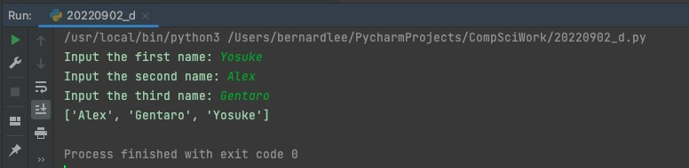

# Task 3
Prompt:Write a program to sort alphabetically three names entered by the user.

## Code Structure
```.py

#2022-09-02 D
#Author: Bernard Lee
#Task 3:Write a program to sort alphabetically three names entered by the user

# Initizalize variables
namelist=[]
namelist.append(input("Input the first name: "))
namelist.append(input("Input the second name: "))
namelist.append(input("Input the third name: "))

# Main Program
for i in range(0,len(namelist)):
    for j in range(0, len(namelist)):
        if namelist[j] < namelist[i]:
            temp = namelist[i]
            namelist[i] = namelist[j]
            namelist[j] = temp
namelist.reverse()
# Print output
print(namelist)

##End of program##

```

## Results

*Fig.1* **Screenshot showing the results of the program
