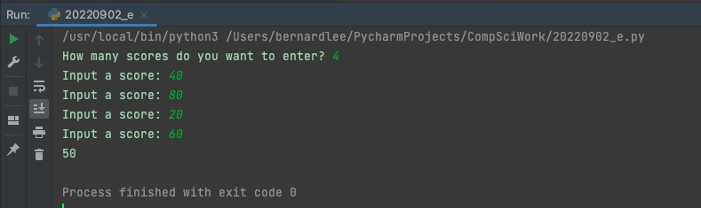
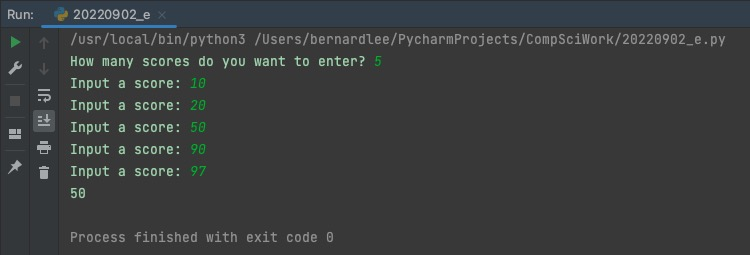

# Task 4
Prompt : Create a program that calculates the median for a list of score entered by the users. The user enters either 4 or 5 scores.

## Code Structure
```.py

#2022-09-02 E
#Author: Bernard Lee
#Task 4:Create a program that calculates the median for a list of score entered by the users. The user enters either 4 or 5 scores.

# Initizalize variables
scorelist=[]
num = int(input("How many scores do you want to enter? "))
#Check for invalid input
if num != 4 and num != 5:
    print("You must enter either 4 or 5 scores")
    exit()

#Gathering User Input
for i in range(0,num):
    scorelist.append(int(input("Input a score: ")))

#Main Program
#scorelist.sort()
for i in range(len(scorelist)):
    for j in range(i+1, len(scorelist)):
        if scorelist[i] < scorelist[j]:
            scorelist[i], scorelist[j] = scorelist[j], scorelist[i]
if len(scorelist) == 5:
    print(scorelist[2])
elif len(scorelist) == 4:
    print(int((scorelist[1]+scorelist[2])/2))
else:
    print("Invalid input")

##End of program##


```

## Results


*Fig.1* **Screenshot showing the results of the program when 4 scores are entered**



*Fig.2* **Screenshot showing the results of the program when 5 scores are entered**


