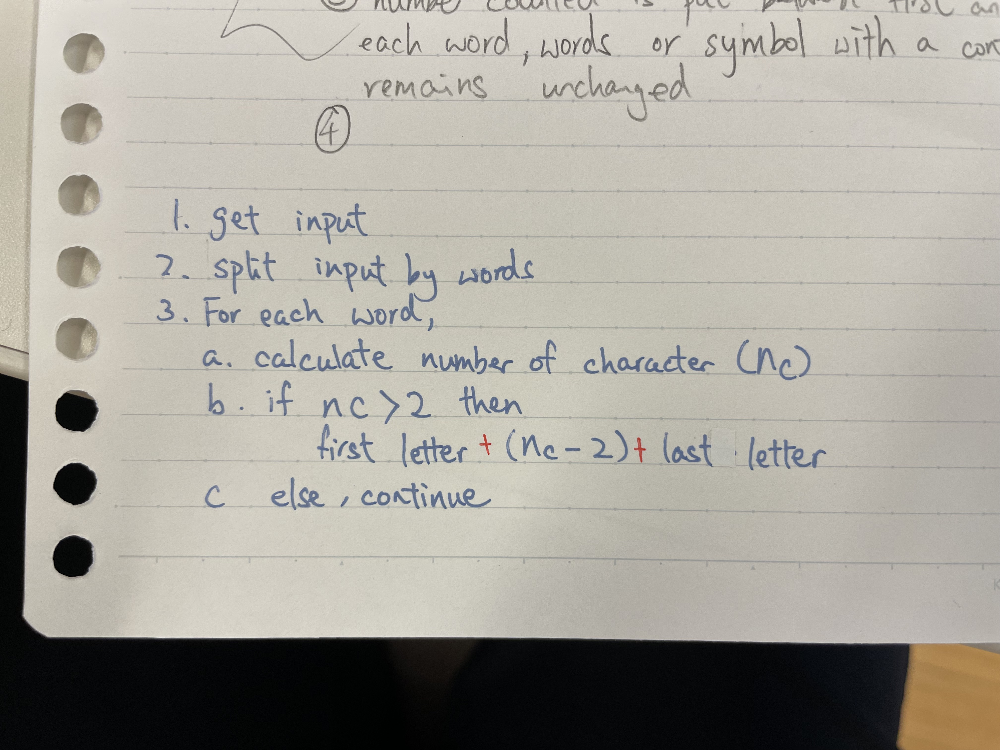
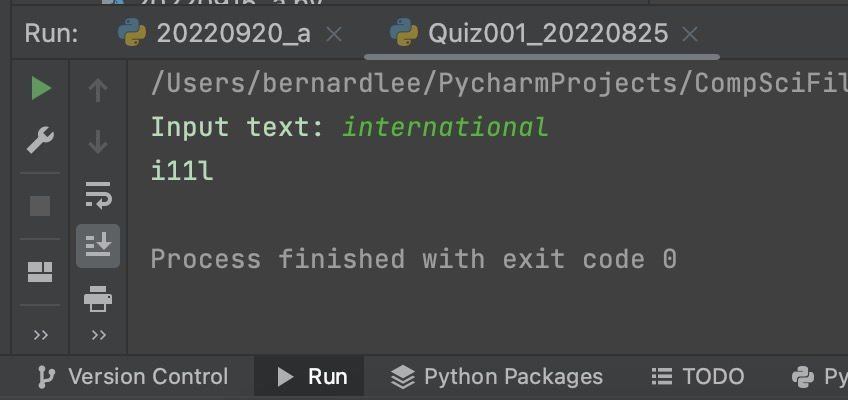

# Quiz 001

## Prompt
Figure out what's in the black box and program it.
| Input                        | Output          |
|------------------------------|-----------------|
| international                | i11l            |
| (cats) + (dogs) = (troubles) | (4) + (4) = (8) |
|                              |                 |

## Flow Diagram

*Fig.1* **Flow diagram of the program**
## Code Structure 
```.py
#2022-08-25 Quiz 001

text = input("Input text: ")
text = text.split()
output = ""
for word in text:
    if len(word) <= 2:
        output += word
    else:
        output += (word[:1] + str(len(word) - 2) + word[-1:])
print(output)
```

## Evidence

*Fig.2* **Screenshot showing the result of the program**
