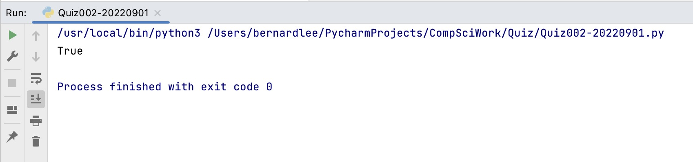

# Quiz 002

## Prompt
Given 2 numbers, A and B, Output True if one of them is 20 or their sum is 20(HL:Array)

## Code Structure 
```.py
#2022-09-01 Quiz 002

#Prompt: Given 2 numbers, A and B, Output True if one of them is 20 or their sum is 20(HL:Array)

#Initizalize variables and arrays
A = [10,30,10,26]
B = [20,15,5,-6]
output = False

#For loop to check each element in A and B
for i in range(len(A)):
    if A[i] == 20 or B[i] == 20 or A[i] + B[i] == 20:
        output = True
#Prints output
print(output)

##End of program##
```

## Evidence

*Fig.1* **Screenshot showing the result of the program**
