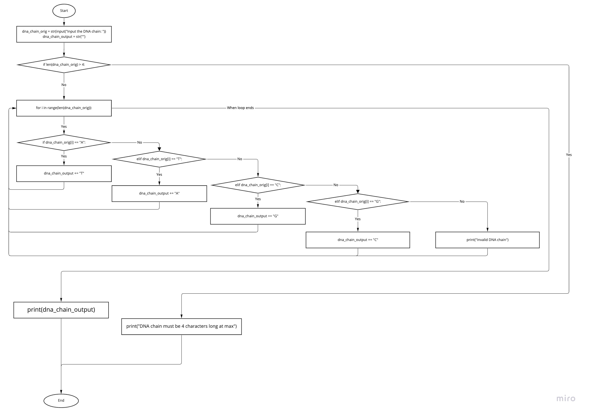
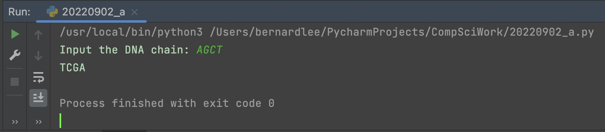

# Quiz 003

## Prompt
Translate the DNA Chain inputted by the user

## Flow Diagram

*Fig.1* **Flow diagram of the program**

## Code Structure 
```.py
# 2022-09-02 A
# Protiens in DNA Chain Translator

# Initizalize variables
dna_chain_orig = str(input("Input the DNA chain: "))
dna_chain_output = str("")

# Check for invalid input
if len(dna_chain_orig) > 4:
    print("DNA chain must be 4 characters long")
    exit()

# Main Program

for i in range(len(dna_chain_orig)):
    if dna_chain_orig[i] == "A":
        dna_chain_output += "T"
    elif dna_chain_orig[i] == "T":
        dna_chain_output += "A"
    elif dna_chain_orig[i] == "C":
        dna_chain_output += "G"
    elif dna_chain_orig[i] == "G":
        dna_chain_output += "C"
    else:
        print("Invalid DNA chain")
        exit()

# dna_chain = dna_chain_orig.upper()
# dna_chain = dna_chain.replace("A","T").replace("G","C").replace("T","A").replace("C","G")
# dna_chain = dna_chain_orig.replace("AGCT","TCGA")


# Print output
print(dna_chain_output)
```

## Evidence

*Fig.2* **Screenshot showing the result of the program**
