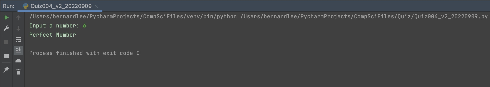
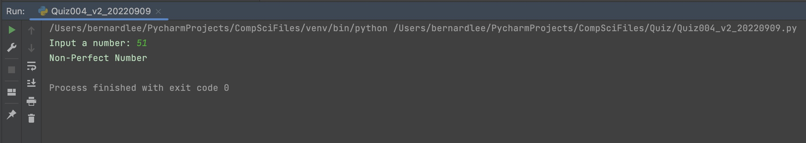

# Quiz 004

## Prompt
Check if inputted number is a perfect number or a non-perfect number

## Code Structure 
```.py
#2022-09-09 Quiz 004
#Check if inputted number is a perfect number or a non-perfect number

#Initialize variables
num = input("Input a number: ")
count = 1
sum = 0

#Check for invalid input
if not num.isnumeric():
    print("Invalid input")
    exit()
num = int(num)

#Main Program
while count < num:
    if num%count == 0:
        sum += count
    count += 1
if sum == num:
    print("Perfect Number")
else:
    print("Non-Perfect Number")

##End of Program##
```

## Evidence

*Fig.1* **Screenshot showing the result of the program when inputted number is perfect**

*Fig.1* **Screenshot showing the result of the program when inputted number is non-perfect**
