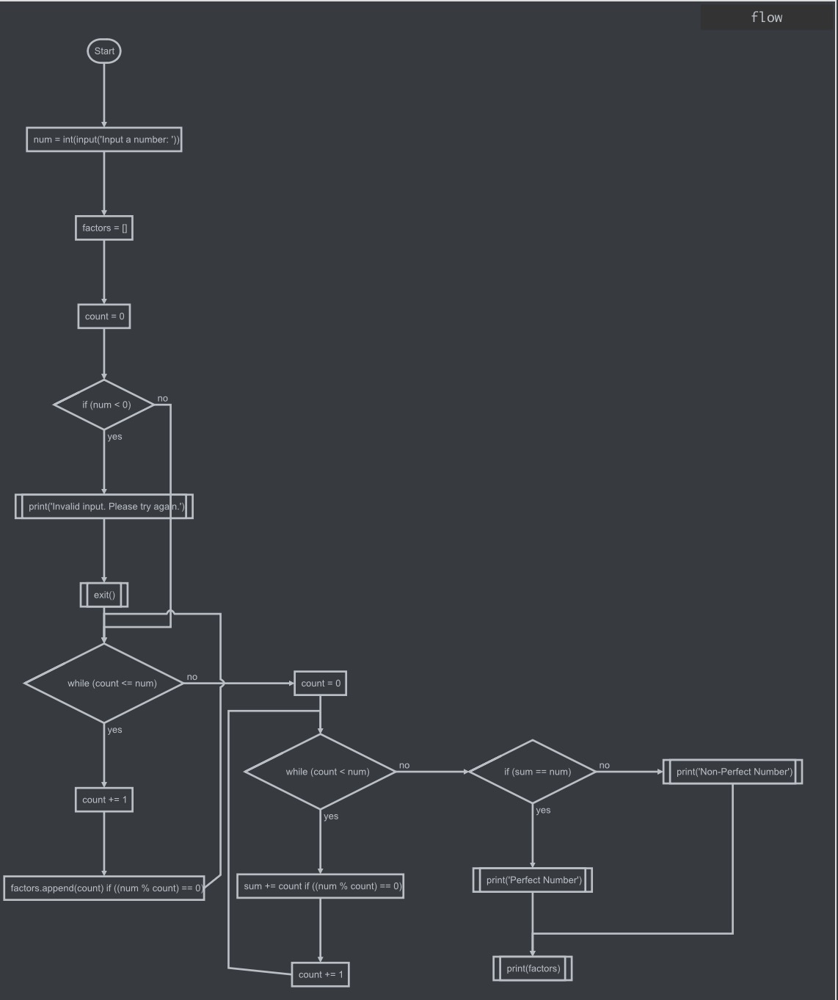
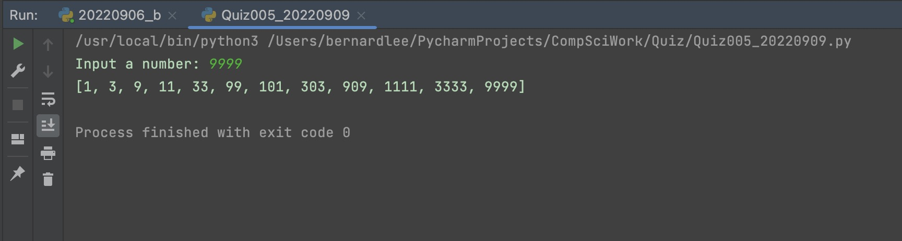

# Quiz 005

## Prompt
Find all factors of a number

## Flow Diagram

*Fig.1* **Flow diagram of the program**

## Code Structure 
```.py
#2022-09-09 Quiz 005
#Find all factors of a number

#Initialize variables
num = int(input("Input a number: "))
factors = []
count = 0

#Check for invalid input
if num < 0:
    print("Invalid input. Please try again.")
    exit()

#Main Program
while count <= num:
    count += 1
    if num % count == 0:
        factors.append(count)

#Print output
print(factors)

##End of Program##
```

## Evidence

*Fig.2* **Screenshot showing the result of the program**
