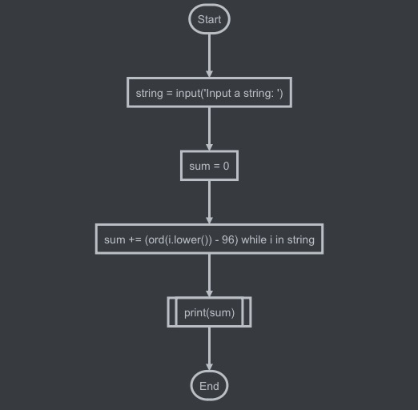
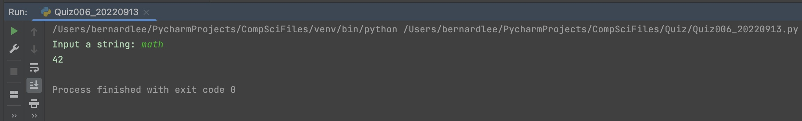

# Quiz 006

## Prompt
Given a string, create a program that produces the sum of the charcter in the string

## Flow Diagram


*Fig.1* **Flow diagram of the program**


## Code Structure 
```.py
#022-09-13 Quiz 006
#Prompt : Given a string, create a program that produces the sum of the charcter in the string
#Example : "Math" -> 42
#Example : "maTH" -> 42
#Example : "Hello world" -> 92
#Example : "Computer SCIENCE" -> 137

#Initialize variables
string = input("Input a string: ")
sum = 0

#Main Program
for i in string:
    sum += ord(i.lower()) - 96


#Print output
print(sum)
```

## Evidence

*Fig.2* **Screenshot showing the result of the program**
