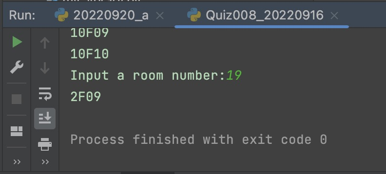

# Quiz 008

## Prompt
A hotel has 10 floors and 10 rooms on each floor. Write a program that prints the names of all rooms in the following format:
1 - Room 1F01
2 - Room 1F02
.
.
100 - Room 10F10

## Flow Diagram

*Fig.1* **Flow diagram of the program**

HL: Use a function receive the room number (1-100) and prints the Room floor location and number
## Code Structure 
```.py
#2022-09-16 Quiz 008
#Prompt : A hotel has ten floors and ten rooms on each floor. Write a program that prints the names of all rooms in the following format: 1F01

assign = []
for floor in range(10):
    for room in range(10):
        print(f"{floor+1}F{room+1:02}")
        assign.append(f"{floor+1}F{room+1:02}")

num = input("Input a room number:")
print(assign[int(num)-1])

##End of Program##
```

## Evidence

*Fig.2* **Screenshot showing the result of the program**
