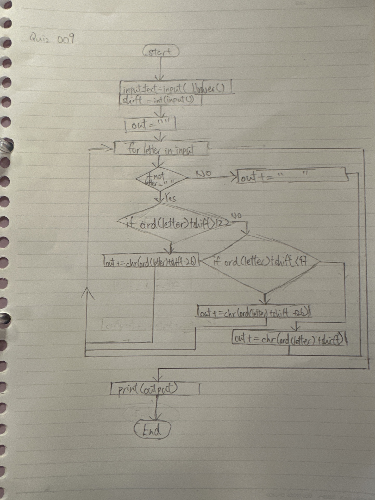
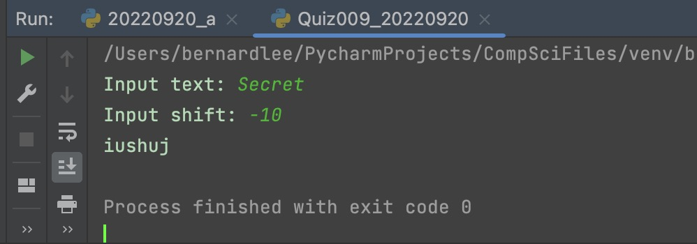

# Quiz 009

## Prompt
Create a function that receives as input a string and returns the string ciphered with shift 13.

For HL :  Ask the user for the shift

## Flow Diagram

*Fig.1* **Flow diagram of the program**

## Code Structure 
```.py
#2022-09-20 Quiz 008
#Cipher by Shift

#Initialize variables
text = input("Input text: ")
text = text.lower()
shift = int(input("Input shift: "))
cipher = ""

#Main Program
for letter in text:
    if not letter == " ": #If letter is not a space
        if ord(letter) + shift > 122:
            cipher += chr(ord(letter) + shift - 26)
        elif ord(letter) + shift < 97:
            cipher += chr(ord(letter) + shift + 26)
        else:
            cipher += chr(ord(letter) + shift)
    else:
        cipher += " "


#Print output
print(cipher)

##End of program##
```

## Evidence

*Fig.2* **Screenshot showing the result of the program**
