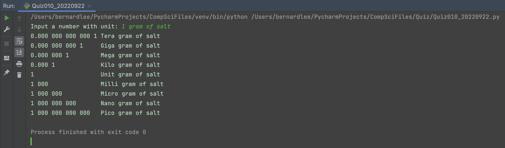

# Quiz 010

## Prompt
Create a function that produces the powers of ten from pico to tera for a number provided as an input parameter.

HL: User inputs number with units (e.g. 1 gram of salt)

## Flow Diagram

*Fig.1* **Flow diagram of the program**
## Code Structure 
```.py
#2022-09-22 Quiz 010

#Create a function that produces the powers of ten from pico to tera for a number provided as an input parameter. The function should return a list of the powers of ten.
#HL: User inputs number with units (e.g. 1 gram of salt)
s = input("Input a number with unit: ")
n = [int(s) for s in s.split() if s.isdigit()]
powers = []
final = []
Units = ["Tera", "Giga", "Mega", "Kilo", "Unit", "Milli", "Micro", "Nano", "Pico"]
length_lmsg = 20


def power(n):
    count = 0
    for i in range(-12, 0, 3):
        temp = abs(i // 3)
        number = f"0.{(('000 ') * temp)}{str(n[0])} ".ljust(length_lmsg)
        powers.append(f"{number}{Units[count]}{s[1:]}")
        count += 1
    for i in range(0, 15, 3):
        temp = i//3
        number = f"{str(n[0])} {('000 '*temp)} ".ljust(length_lmsg)
        powers.append(f"{number}{Units[count]}{s[1:]}")
        count += 1

    return powers

print("\n".join(power(n)))

```

## Evidence

*Fig.2* **Screenshot showing the result of the program**
