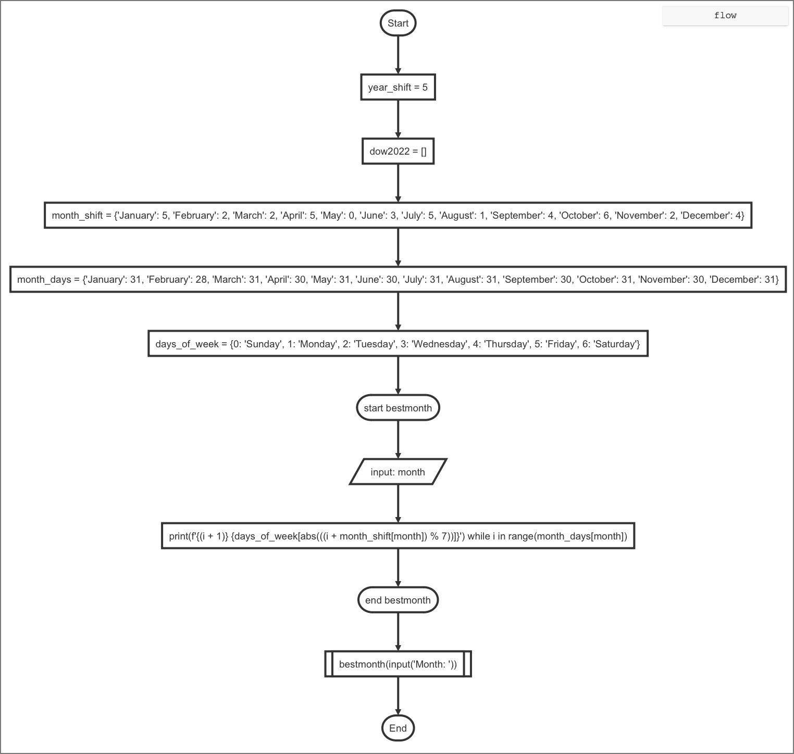
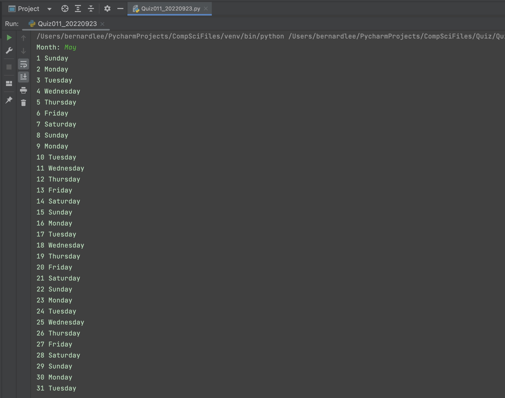
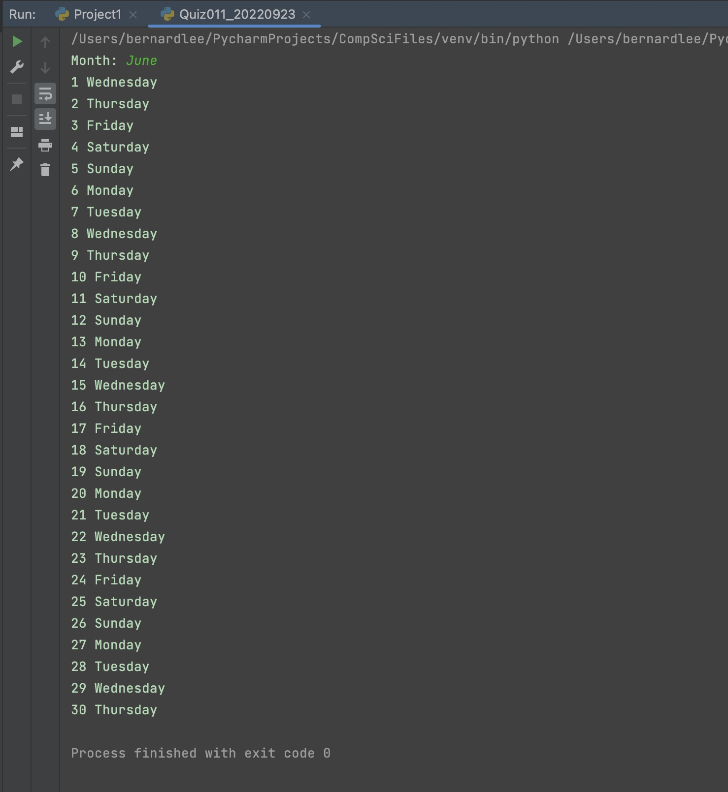

# Quiz 011

## Prompt
Create a function that shows the days of your bithday's month in the year 2022 along with the day of the week
HL: The function must receive the month of your birthday

## Flow Diagram

*Fig.1* **Flow diagram of the program**
## Code Structure 
```.py
#2022-09-23 Quiz 011
#Create a function that shows the days of your bithday's month in the year 2022 along with the day of the week
# HL: The function must receive the month of your birthday
year_shift = 5
dow2022 = []
month_shift = {
    "January": 5,
    "February": 2,
    "March": 2,
    "April": 5,
    "May": 0,
    "June": 3,
    "July": 5,
    "August": 1,
    "September": 4,
    "October": 6,
    "November": 2,
    "December": 4
}
month_days = {
        "January": 31,
        "February": 28,
        "March": 31,
        "April": 30,
        "May": 31,
        "June": 30,
        "July": 31,
        "August": 31,
        "September": 30,
        "October": 31,
        "November": 30,
        "December": 31,
    }
days_of_week = {
        0: "Sunday",
        1: "Monday",
        2: "Tuesday",
        3: "Wednesday",
        4: "Thursday",
        5: "Friday",
        6: "Saturday"
}
#for i in range(365):
    #dow2022.append((i%7)+year_shift)
#for i in range(month_days[input("Month: ")]):
    #print(f"{i+1} {days_of_week[abs(dow2022[i])]}")

def bestmonth(month):
    for i in range(month_days[month]):
        print(f"{i+1} {days_of_week[abs((i+month_shift[month])%7)]}")


bestmonth(input("Month: "))

## End of Program##
```

## Evidence

*Fig.2* **Screenshot showing the result of the program when the input is May**


*Fig.2* **Screenshot showing the result of the program when the input is June**


