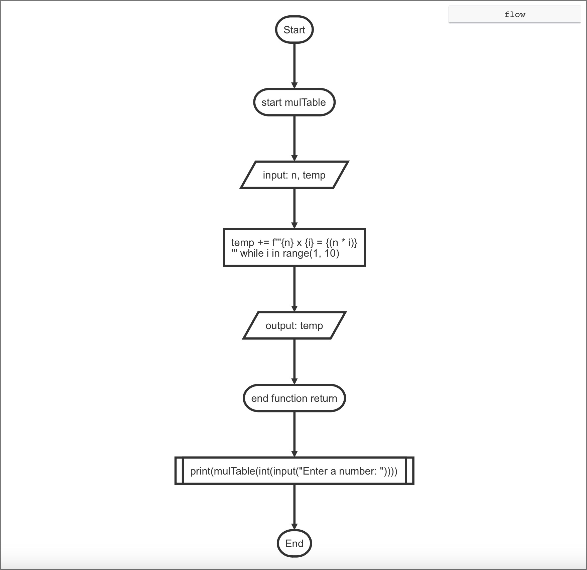
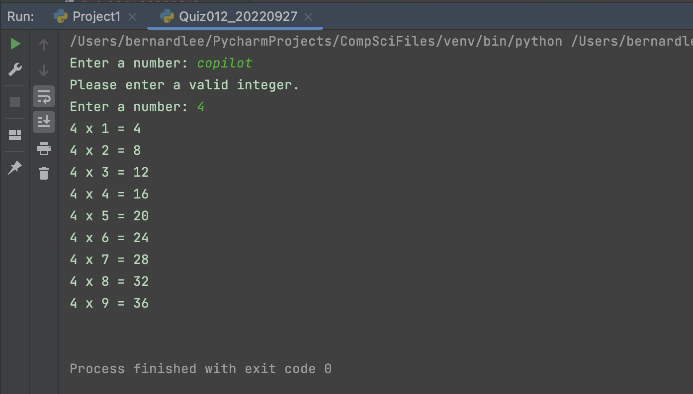

# Quiz 012

## Prompt
Create a function that reviebes integer 2<n<10, and returns the multiplication table of that number up to 9.

## Flow Diagram


*Fig.1* **Flow diagram of the program**

## Code Structure 
```.py
#2022-09-27 Quiz 012

#Create a function that reviebes integer 2<n<10, and returns the multiplication table of that number up to 9.

#Example: mulTable(2) returns "2 x 1 = 2

from my_lib import validate_int_input
def mulTable(n, temp=""):
    for i in range(1,10):
        temp += f"{n} x {i} = {n*i}\n"

    return temp

print(mulTable(int(validate_int_input("Enter a number: "))))

## End of Program##
```

## Evidence

*Fig.2* **Screenshot showing the result of the program**
