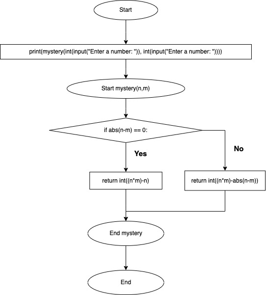
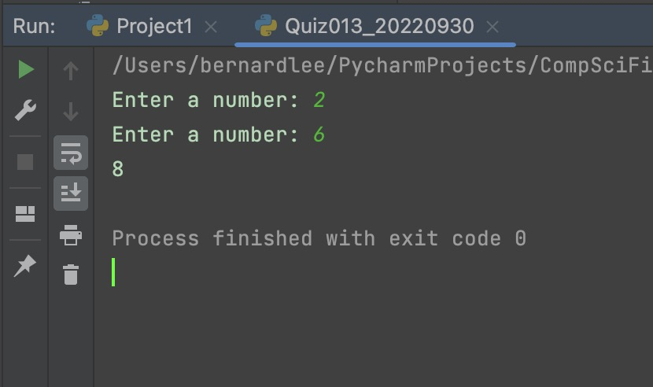
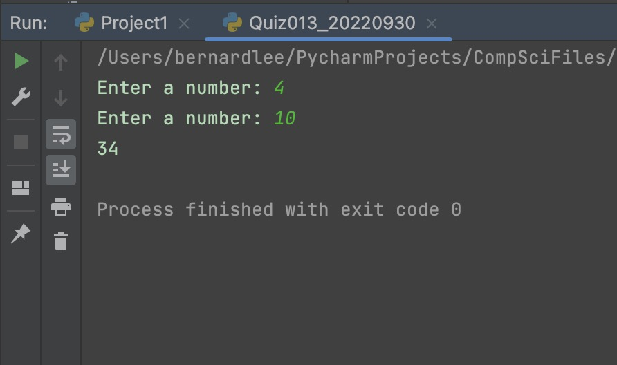
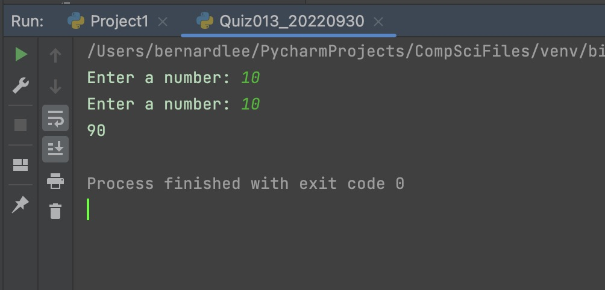

# Quiz 013

## Prompt
Create a function that recieves one input and produces the output shown below.

Example: Input 2,6 Output 8

Example: Input 4,10 Output 34

Example: Input 10,10 Output 90

Example: Input 70,50 Output 3480

## Flow Diagram


*Fig.1* **Flow diagram of the program**


## Code Structure 
```.py
#2022-09-30 Quiz 013
#Create a function that recieves one input and produces the output shown below.
#Example: Input 2,6 Output 8
#Example: Input 4,10 Output 34
#Example: Input 10,10 Output 90
#Example: Input 70,50 Output 3480

def mystery(n, m):
    if abs(n-m) == 0:
        return int((n*m)-n)
    else:
        return int((n*m)-abs(n-m))

print(mystery(int(input("Enter a number: ")), int(input("Enter a number: "))))
```

## Evidence


*Fig.2* **Screenshot showing the result of the program**



*Fig.3* **Screenshot showing the result of the program**



*Fig.4* **Screenshot showing the result of the program**



*Fig.5* **Screenshot showing the result of the program**
