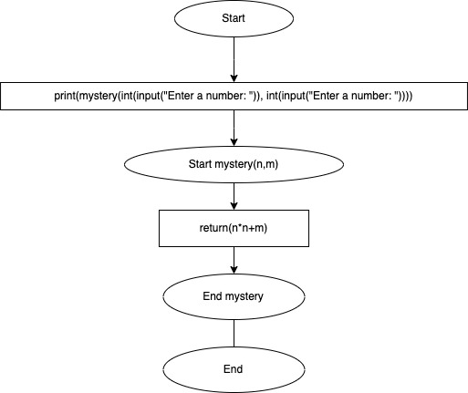
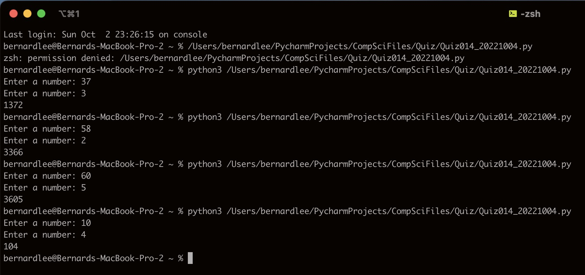

# Quiz 014

## Prompt
Create a function that recieves one input and produces the output shown below.
| Input A:int B:int | Output :int |
|-------------------|-------------|
| 37, 3             | 1372        |
| 58, 2             | 3366        |
| 60, 5             | 3605        |
| 10, 4             | 104         |
## Flow Diagram

*Fig.1* **Flow diagram of the program**
## Code Structure 
```.py
#2022-10-04 Quiz 014
#Prompt: Create a function that recieves one input and produces the output shown below.
#Example: Input 37,3 Output 1372
#Example: Input 58,2 Output 3366
#Example: Input 60,5 Output 3605
#Example: Input 10,4 Output 104


def mystery(n, m):
    return(n*n+m)

print(mystery(int(input("Enter a number: ")), int(input("Enter a number: "))))
```

## Evidence

*Fig.2* **Screenshot showing the result of the program**
