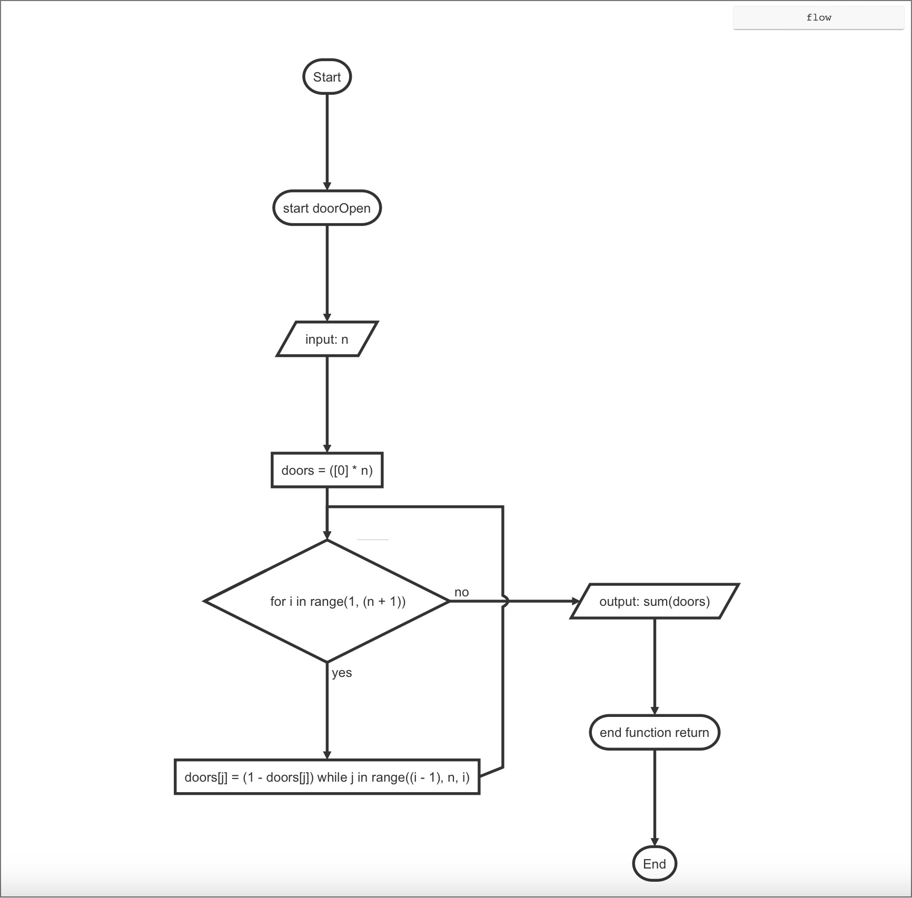
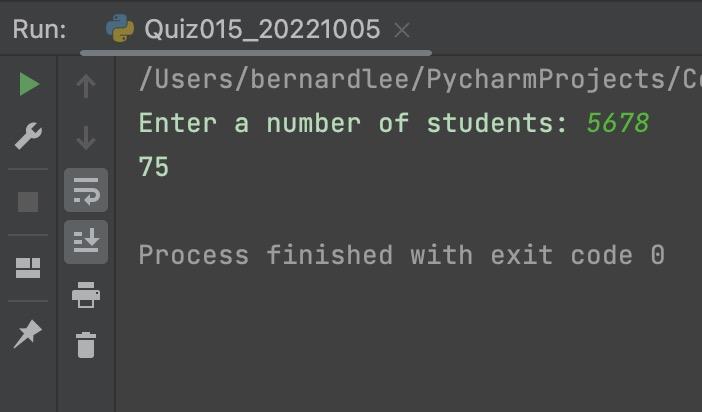

# Quiz 015

## Prompt
There are N closed doors in a school and N students present. The first student opens all the doors. The second student closes every second door. The third student toggles every third door (closes if open, opens if closed) and so on.

HL: Create a function that shows number of doors that are open after N students have passed through the school.

## Flow Diagram

*Fig.1* **Flow diagram of the program**
## Code Structure 
```.py
#2022-10-05 Quiz 015

#There are N closed doors in a school and N students present. The first student opens all the doors. The second student closes every second door. The third student toggles every third door (closes if open, opens if closed) and so on.
#HL: Create a function that shows number of doors that are open after N students have passed through the school.

#Example: Input 10 returns 3
#Example: Input 100 returns 10

def doorOpen(n):
    doors = [0]*n
    for i in range(1, n+1):
        for j in range(i-1, n, i):
            doors[j] = 1 - doors[j]
    return sum(doors)

print(doorOpen(int(input("Enter a number of students: "))))

## End of Program##
```

## Evidence

*Fig.2* **Screenshot showing the result of the program**
