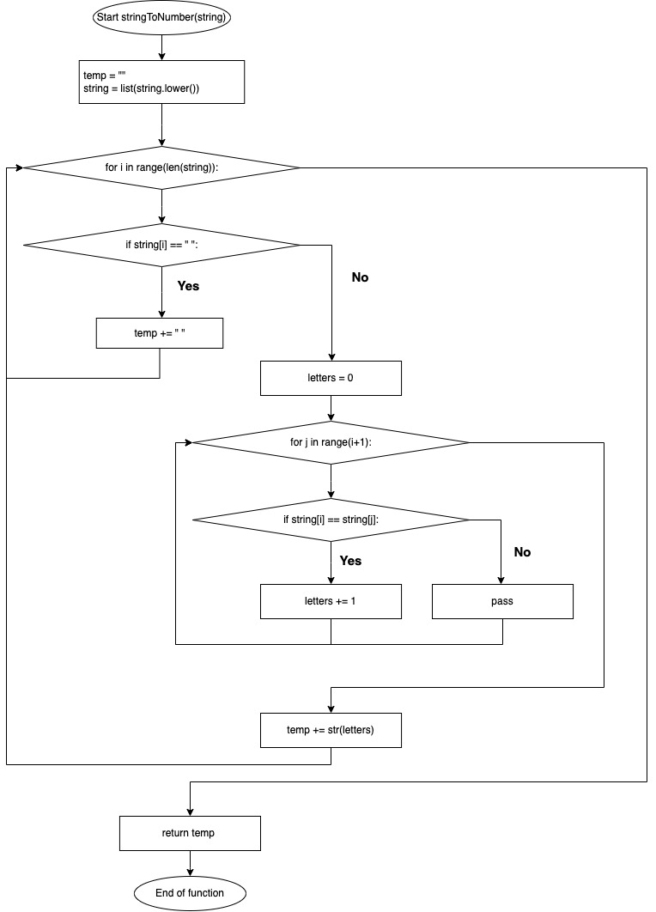
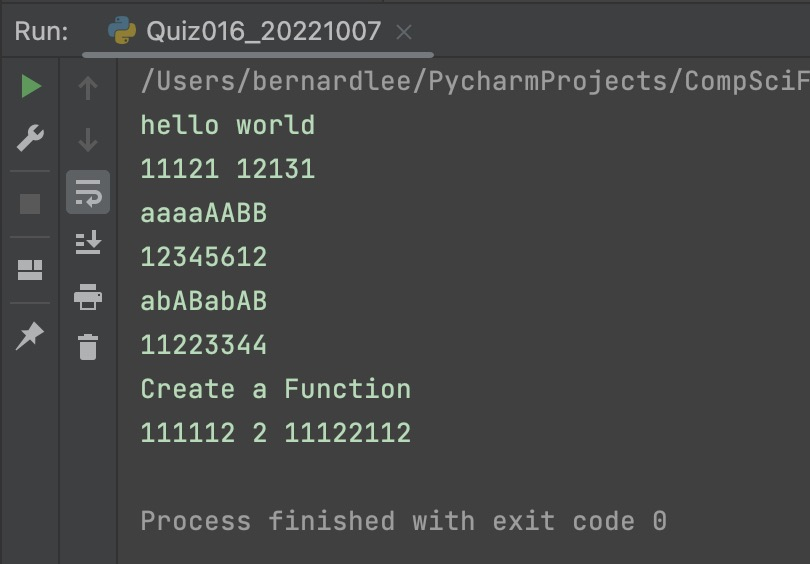

# Quiz 016

## Prompt
Create a function that produces the output of the following output:
| Input :str          | Output :str       |
|---------------------|-------------------|
| "hello world"       | 11121 12131       |
| "aaaaAABB"          | 12345612          |
| "abABabAB"          | 11223344          |
| "Create a function" | 111112 2 11122112 |

## Flow Diagram


*Fig.1* **Flow diagram of the program**

## Code Structure 
```.py
# 2022-10-07 Quiz 016
# Create a function that produces the output of the following output:
# Example: Inout "hello world" returns "11121 12131"
# Example: Input "aaaAABB" returns "12345612"
# Example: Input "abABabAB" returns "11223344"
# Example: Input "Create a Function" returns "111112 2 1122111"

def stringToNumber(string):
    temp = ""
    string = list(string.lower())
    for i in range(len(string)):
        if string[i] == " ":
            temp += " "
        else:
            letters = 0
            for j in range(i+1):
                if string[i] == string[j]:
                    letters += 1
            temp += str(letters)

    return temp

l = ["hello world", "aaaaAABB", "abABabAB", "Create a Function"]
for i in l:
    print(i)
    print(stringToNumber(i))

```

## Evidence


*Fig.2* **Screenshot showing the result of the program**
