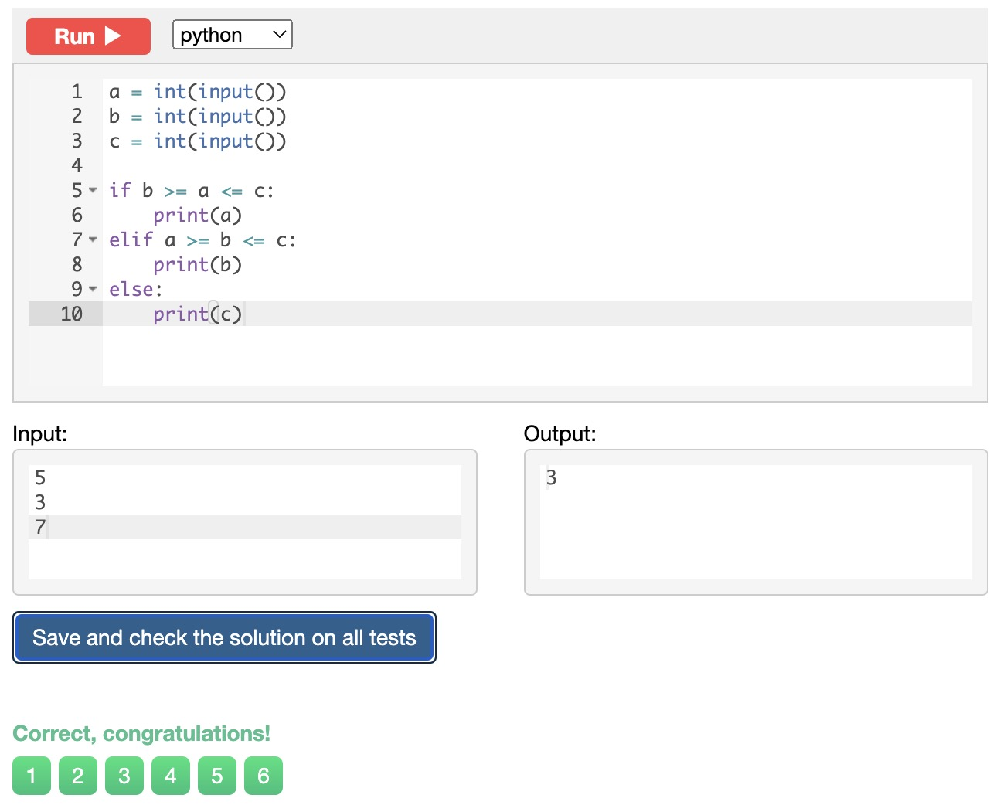
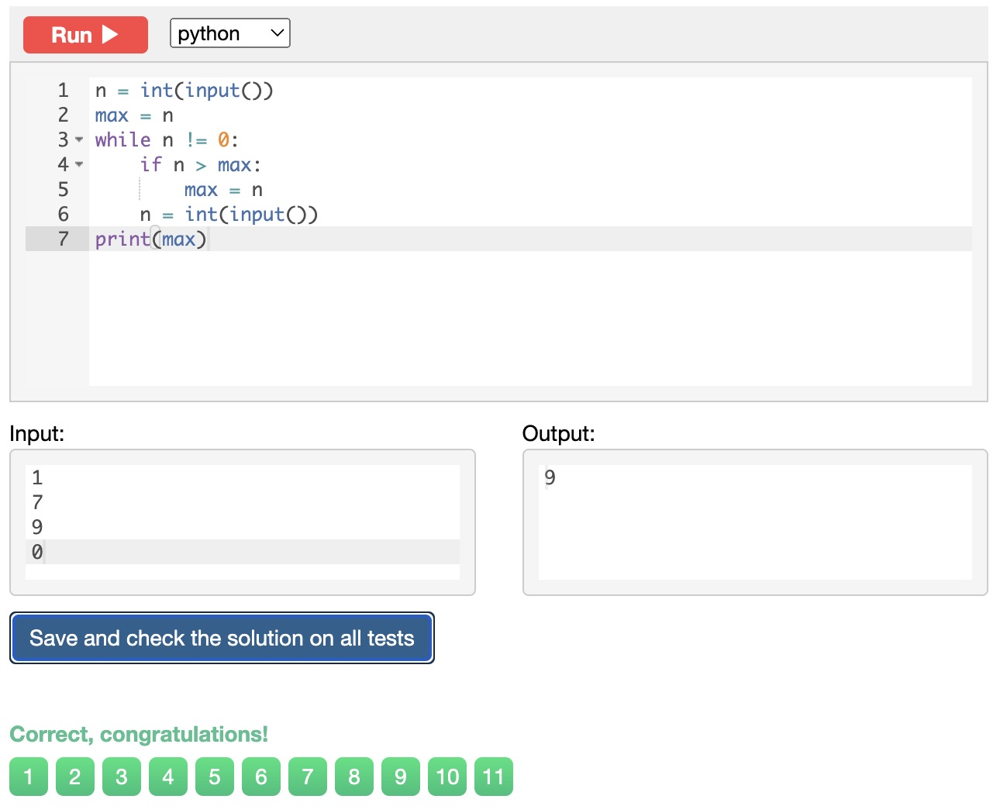
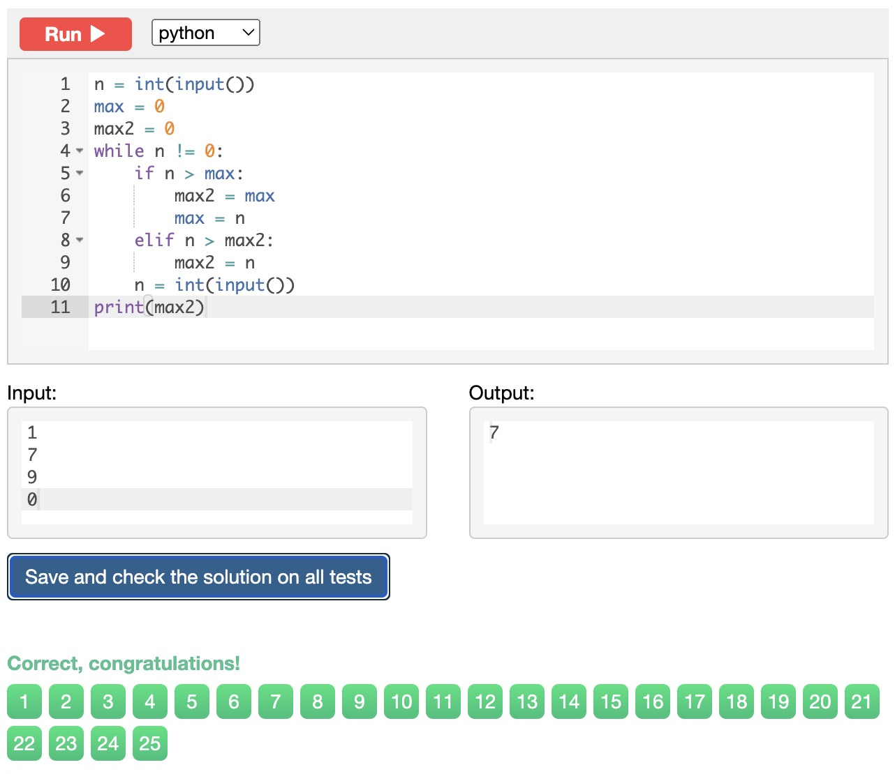
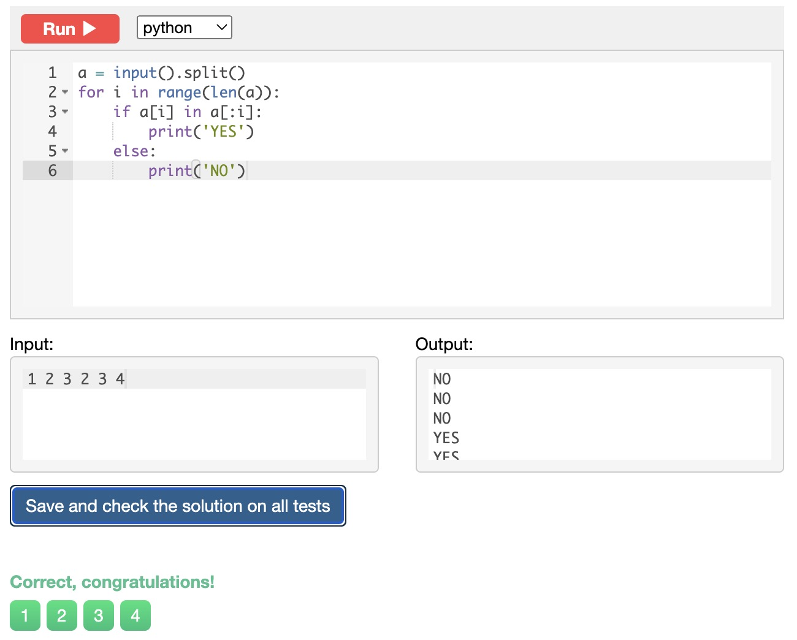
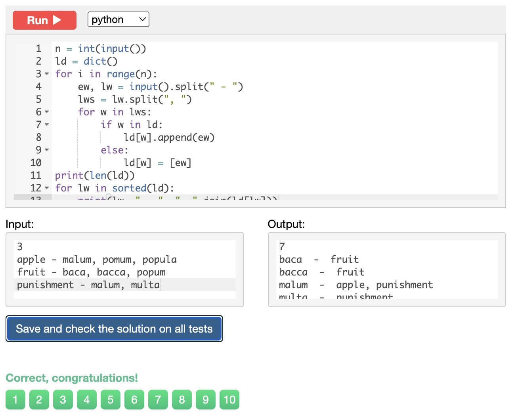

# Snakify Exercises
## Chapter 1: Input, print and numbers

### Sum of three numbers
```.py
a = int(input())
b = int(input())
c = int(input())
print(a + b + c)
```


### Hi John
```.py
a = input()
b = "Hi"
print(b,a)
```


### Square
```.py
a = int(input())
print (a**2)
```


### Area of right-angled triangle
```.py
b = int(input())
h = int(input())
print(b*h/2)
```


### Hello, Harry!
```.py
name = input()
print('Hello,', name+"!")
```


### Apple sharing
```.py
n = int(input())
k = int(input())
print(k // n)
print(k % n)
```


### Previous and next
```.py
a = int(input())
print("The next number for the number",a,"is", a+1.)
print("The previous number for the number",a,"is", a-1.)
```


### Two timestamps
```.py
h1 = int(input())
m1 = int(input())
s1 = int(input())
h2 = int(input())
m2 = int(input())
s2 = int(input())

final1 = h1*60*60+m1*60+s1
final2 = h2*60*60+m2*60+s2

print(final2-final1)
```


### School desks
```.py
a = int(input())
b = int(input())
c = int(input())

if (a % 2) != 0:
    a=a+1
a=a/2
if (b % 2) != 0:
    b=b+1
b=b/2
if (c % 2) != 0:
    c=c+1
c=c/2
    
final = a+b+c
print(final)
```


## Chapter 2: Integer and float numbers

### Last digit of integer
```.py
a = int(input())
print(a%10)
```


### Two digits
```.py
a = int(input())
aanswer = a%10 
a = a//10
print(a, aanswer)
```


### Swap digits
```.py
a = int(input())
aanswer = a%10 
a = a//10
a = str(a)
aanswer=str(aanswer)
print(aanswer+a)
```


### Last two digits
```.py
a=int(input())
print(a%100)
```


### Tens digit
```.py
number = int(input("Input an integer: "))
number = number//10
answer = number%10 
print(answer)
```


### Sum of digits
```.py
a=int(input())
print((a//100)+((a%100)//10)+((a%100)%10))
```


### Reverse three digits
```.py
a = int(input())
b = (a//100)
c = ((a%100)//10)
d = ((a%100)%10)
b=str(b)
c=str(c)
d=str(d)
print(d+c+b)
```


### Merge two numbers
```.py
a = int(input())
b = int(input())

a1 = (str(a//10))
a2 = (str(a%10))
b1 = (str(b//10))
b2 = (str(b%10))

print(a1+b1+a2+b2)
```


### Cyclic rotation
```.py
num = int(input())
res = [int(x) for x in str(num)]
print(str(res[2])+str(res[3])+str(res[0])+str(res[1]))
```


### Fractional Part
```.py
a = float(input())
b = int(a)
a=a-b
print(a)
```


### First digit after decimal point
```.py
b = float(input())
a = (int((b*10)%10))
print(a)
```


### Car route
```.py
from math import ceil

n = int(input())
m = int(input())
print(ceil(m/n))
```


### Day of week
```.py
a = int(input())
a=a+3
a=a%7
print(a)
```


### Digital clock
```.py
N = int(input())
print(N//60, N%60)
```


### Total cost
```.py
a = int(input())
b = int(input())
c = int(input())

print(((a*c)+b*c//100),((b*c)%100))
```


### Century
```.py
a = int(input())
if a%100 == 0:
    print(a//100)
else:
    print(a//100+1)
```


### Snail
```.py
from math import ceil

h = int(input())
a = int(input())
b = int(input())
print(ceil((h - a) / (a - b)) + 1)
```


### Clock face - 1
```.py
h = int(input())
m = int(input())
s = int(input())

print(h * 30 + m * 30 / 60 + s * 30 / 3600)
```


### Clock face - 2
```.py
a = float(input())
a = (a%30)*12
print(a)
```


## Chapter 3: Conditions: if, then, else

### Is Positive
```.py
a = int(input())
if a >= 0:
    print("YES")
else:
    print("NO")
```


### Is odd
```.py
a = int(input())

if a%2 != 0:
    print("YES")
else:
    print("NO")
```


### Is even
```.py
a = int(input())

if a%2 == 0:
    print("YES")
else:
    print("NO")
```


### Ends on seven
```.py
a = int(input())
if a%10 == 7:
    print("YES")
else:
    print("NO")
```


### Minimum of two numbers
```.py
a = int(input())
b = int(input())

if a<b:
    print(a)
else:
    print(b)
```


### Are both odd
```.py
a = int(input())
b = int(input())

if a%2 != 0 and b%2 != 0:
    print("YES")
else:
    print("NO")
```


### At least one odd
```.py
a = int(input())
b = int(input())

if a%2 != 0 or b%2 != 0:
    print("YES")
else:
    print("NO")
```


### Exactly one odd
```.py
a = int(input())
b = int(input())

if a%2 != 0 and b%2 == 0:
    print("YES")
elif a%2 == 0 and b%2 != 0:
    print("YES")
else:
    print("NO")
```


### Sign function
```.py
a = int(input())

if a == 0:
    print("0")
elif a>0:
    print("1")
else:
    print("-1")
```


### Numbers in ascending order
```.py
a = int(input())
b = int(input())
c = int(input())

if a<b<c :
    print("YES")
else:
    print("NO")
```


### Is three digits
```.py
a = int(input())

if 99<a<1000:
    print("YES")
else:
    print("NO")
```


### Minimum of three numbers
```.py
a = int(input())
b = int(input())
c = int(input())

if b >= a <= c:
    print(a)
elif a >= b <= c:
    print(b)
else:
    print(c)
```



### Equal numbers
```.py
a = int(input())
b = int(input())
c = int(input())
if a == b == c:
    print(3)
elif a == b or b == c or a == c:
    print(2)
else:
    print(0)
```


### Rook move
```.py
x1 = int(input())
y1 = int(input())
x2 = int(input())
y2 = int(input())
if x1 == x2 or y1 == y2:
    print('YES')
else:
    print('NO')
```


### Chess board - black square
```.py
column = int(input())
row = int(input())

if row % 2 == column % 2:
    print('BLACK')
else:
    print('WHITE')
```


### Chess board - same color
```.py
column = int(input())
row = int(input())
column1=int(input())
row1=int(input())

if (row+column+row1+column1)%2==0:
    print('YES')
else:
    print('NO')
```


### Distance to the cloest point
```.py
a = int(input())
b = int(input())
c = int(input())

a_to_b = abs(a - b)
a_to_c = abs(a - c)

if a_to_b < a_to_c:
    print(a_to_b)
else:
    print(a_to_c)
```


### Digits in ascending order
```.py
a = int(input())


if a//100<(a%100-a%10)/10<a%10:
    print("YES")
else:
    print("NO")
```


### Four-digit palindrome
```.py
num=int(input())
temp=num
rev=0
while(num>0):
    dig=num%10
    rev=rev*10+dig
    num=num//10
if(temp==rev):
    print("YES")
else:
    print("NO")
```


### King move
```.py
x1 = int(input())
y1 = int(input())
x2 = int(input())
y2 = int(input())
if x1 - x2 < 2 and y1 - y2 < 2 and x1 - x2 > -2 and y1 - y2 > -2 :
    print('YES')
else:
    print('NO')
```


### Bishop move
```.py
x1 = int(input())
y1 = int(input())
x2 = int(input())
y2 = int(input())
if x1 - x2 == y1 - y2 or x1 - x2 == y2 - y1:
    print('YES')
else:
    print('NO')
```


### Queen move
```.py
x1 = int(input())
y1 = int(input())
x2 = int(input())
y2 = int(input())
if x1 == x2 or y1 == y2 or x1 - x2 == y1 - y2 or x1 - x2 == y2 - y1:
    print('YES')
else:
    print('NO')
```


### Index of outlier
```.py
a = int(input())
b = int(input())
c = int(input())

if a==b!=c:
    print("3")
elif a==c!=b:
    print("2")
elif a!=b==c:
    print("1")
```


### Knight move
```.py
x1 = int(input())
y1 = int(input())
x2 = int(input())
y2 = int(input())

if abs(x1-x2)==2 and abs(y1-y2)==1 or abs(x1-x2)==1 and abs(y1-y2)==2:
    print("YES")
else:
    print("NO")
```


### Chocolate bar
```.py
n = int(input())
m = int(input())
k = int(input())
if k <= n * m and (k % n == 0 or k % m == 0):
    print('YES')
else:
    print('NO')
```


### Leap year
```.py
a=int(input())
if a%4==0 and a%100!=0 or a%400==0:
    print("LEAP")
else:
    print("COMMON")
```


### Days in months
```.py
a = int(input())

if a == 1 or a == 3 or a == 5 or a == 7 or a == 8 or a == 10 or a == 12:
    print("31")
elif a == 4 or a == 6 or a == 9 or a == 11:
    print("30")
else:
    print("28")
```


### Next day
```.py
a = int(input())
b = int(input())
if b == 31:
    a = a+1
    b =1
elif b == 30:
    if a == 4 or a == 6 or a == 9 or a == 11:
        a = a+1
        b =1
    else: b = b+1
elif a==2 and b==28:
    a = a+1
    b =1
else:
    b = b+1

if a > 12:
    a = 1

print(a)
print(b)
```


### Linear equation
```.py
a = int(input())
b = int(input())

if a == 0 and b == 0:
    print("many solutions")
elif a == 0 or b == 0:
    print("no solution")

elif b%a != 0 or a == 0 or b == 0:
    print("no solution")
else:
    print(b/a)
```


### Vertices of rectangle
```.py
x1 = int(input())
y1 = int(input())
x2 = int(input())
y2 = int(input())
x3 = int(input())
y3 = int(input())

if x1 == x2:
    x4 =x3
elif x1 == x3:
    x4 = x2
else:
    x4 = x1

if y1 == y2:
    y4=y3
elif y1 == y3:
    y4 = y2
else:
    y4 = y1

print(x4)
print(y4)
```


### Sort three numbers
```.py
a = int(input())
b = int(input())
c = int(input())

if a > b:
    a , b = b , a
    
if a > c:
    a, c = c, a
if b > c:
    b, c = c, b

print(a)
print(b)
print(c)
```


### White pawn move
```.py
x1 = int(input())
y1 = int(input())
x2 = int(input())
y2 = int(input())
if abs(x1 - x2) < 2 and y1 > 1 and y1 < y2:
    if y2 - y1 < 2:
        print("YES")
    elif y1 == 2 and y2 - y1 < 3 and x1 == x2:
        print("YES")
    else:
        print("NO")
else:
    print("NO")
```


## Chapter 4: For loop with range

### Count to N
```.py
n = int(input())

for i in range(1,n+1):
    print(i)
```


### Series - 1
```.py
a = int(input())
b = int(input())

for i in range (a ,b+1):
    print(i)
```


### First N odd, ascending
```.py
a = int(input())

for i in range(1,a+1):
    if i%2 != 0:
        print(i)
```


### Series - 2
```.py
a = int(input())
b = int(input())

if a < b:
    for i in range(a,b+1):
        print(i)
else:
    for i in reversed(range(b,a+1)):
        print(i)
```


### First N even, descending
```.py
n = int(input())

for i in range(n,-1,-1):
    if i % 2 == 0:print(i)
```


### Sum of ten numbers
```.py
sum=0
for i in range(10):
    a = int(input())
    sum = sum + a
print(sum)
```


### Sum of N numbers
```.py
sum=0
n = int(input())
for i in range(n):
    a = int(input())
    sum = sum + a
print(sum)
```


### Product of N numbers
```.py
sum=1
n = int(input())
for i in range(n):
    a = int(input())
    sum = sum * a
print(sum)
```


### Sum of cubes
```.py
a = int(input())
sum=0
for i in range(a):
    sum=sum+(i+1)**3
print(sum)
```


### Factorial
```.py
a = int(input())
sum = 1
for i in range(2,a+1):
    sum = sum*i
print(sum)
```


### The number of zeros
```.py
n = int(input())
count = 0
for i in range(n):
    var = int(input())
    if var == 0:
        count = count+1
print(count)
```


### Adding factorials
```.py
n = int(input("n: "))
factorial = 1
result = 0

for x in range(n):
  x += 1
  factorial *= x
  result += factorial
  
print(result)
```


### Squares in range
```.py
a = int(input())
b = int(input())

for i in range(a,b+1):
    print(i,"*",i,"=",i*i,sep="")
```


### Ladder
```.py
n = int(input())
sum = ""
for i in range(1,n+1):
    sum = sum + str(i)
    print(sum)
```


### Is prime
```.py
num = int(input())
prime = False
if num > 1:
    for i in range(2, num):
        if (num % i) == 0:
            prime = True
            break
if prime:
    print("COMPOSITE")
else:
    print("PRIME")
```


### Print primes in range
```.py
a = int (input ())
b = int (input ())
for n in range(a, b + 1):
    is_prime = True
    for i in range(2, n - 1):
        if n% i == 0:
            is_prime = False
    if is_prime:
        print (n)
```


### Number of primes in range
```.py
a = int (input ())
b = int (input ())
count = 0
for n in range(a, b + 1):
    is_prime = True
    for i in range(2, n - 1):
        if n% i == 0:
            is_prime = False
    if is_prime:
        count = count + 1
print(count)
```


### Lost card
```.py
answer=0
N=int(input())
Original=N 
for i in range(N-1):
  N=int(input())
  answer+=N
for i in range(Original):
  Original+=i
  i+=N
Original-=answer
print(Original)
```


## Chapter 5: Strings

### Slices
```.py
n = input()
print(n[2])
print(n[-2])
print(n[:5])
print(n[:-2])
print(n[::2])
print(n[1::2])
print(n[::-1])
print(n[::-2])
print(len(n))
```


### The number of words
```.py
n = input()
print(n.count(' ') + 1)
```


### The two halves
```.py
s = input()
print(s[(len(s) + 1) // 2:] + s[:(len(s) + 1) // 2])
```


### To swap the two words
```.py
n = input()
print(n.split()[1], n.split()[0])
```


### The first and last occurrence
```.py
n = input()
if n.count('f') == 1:
    print(n.find('f'))
elif n.count('f') > 1:
    print(n.find('f'), n.rfind('f'))
```


### The second occurrence
```.py
n = input()
if n.count('f') == 1:
    print(-1)
elif n.count('f') == 0:
    print(-2)
else:
    print(n.find('f', n.find('f') + 1))
```


### Remove the fragment
```.py
n = input()
print(n[:n.find('h')] + n[n.rfind('h') + 1:])
```


### Reverse the fragment
```.py
n = input()
print(n[:n.find('h')] + n[n.rfind('h'):n.find('h'):-1] + n[n.rfind('h'):])
```


### Replace the substring
```.py
num = input()
print(num.replace('1', 'one'))
```


### Delete a character
```.py
str = input()
str = str.replace('@', '')
print(str)
```


### Replace within the fragment
```.py
s = input()
first = s.find('h')
last = s.rfind('h')
print(s[:first+1] + s[first+1:last].replace('h','H') + s[last:])
```


### Delete every third character
```.py
n = input()
for i in range(len(n)):
    if i % 3 != 0:
        print(n[i], end="")
```


##Chapter 6: While Loop

### List of squares
```.py
n = int(input())
i = 1
while i ** 2 <= n:
    print(i ** 2)
    i += 1
```


### Least divisor
```.py
n = int(input())
i = 2
while n % i != 0:
    i += 1
print(i)
```


### The power of two
```.py
n = int(input())
x = 0
while 2 ** x <= n:
    x += 1
print(x - 1, 2 ** (x - 1))
```


### Morning jog
```.py
a = int(input())
b = int(input())
i = 1
while a < b:
    i += 1
    a = a * 1.1
    
print(i)
```


### The length of the sequence
```.py
n = int(input())
count = 0
while n != 0:
    n = int(input())
    count += 1
print(count)
```


### The sum of the sequence
```.py
count = 0
sum = 0
while True:
    num = int(input())
    if num == 0:
        print(sum)
        break
    else:
        sum += num
        count += 1
```


### The average of the sequence
```.py
sum = 0
count = 0
element = int(input())
while element != 0:
    sum += element
    element = int(input())
    count += 1
    
print(sum/count)
```


### The maximum of the sequence
```.py
n = int(input())
max = n
while n != 0:
    if n > max:
        max = n
    n = int(input())
print(max)
```


### The index of the maximum of a sequence
```.py
n = int(input())
i = 0
max = 0
index = 0
while n != 0:
    if n > max:
        max = n
        index = i +1
    n = int(input())
    i += 1
print(index)
```


### The number of even elements of the sequence
```.py
n = int(input())
count = 0
while n != 0:
    if n % 2 == 0:
        count += 1
    n = int(input())
print(count)
```


### The number of elements that are greater than the previous one
```.py
n = int(input())
count = 0
while n != 0:
    m = n
    n = int(input())
    if n > m:
        count += 1
print(count)
```


### The second maximum
```.py
n = int(input())
max = 0
max2 = 0
while n != 0:
    if n > max:
        max2 = max
        max = n
    elif n > max2:
        max2 = n
    n = int(input())
print(max2)
```


### The number of elements equal to the maximum
```.py
n = int(input())
max = n
count = 0
while n != 0:
    if n > max:
        max = n
        count = 1
    elif n == max:
        count += 1
    n = int(input())
print(count)
```


### Fibonacci numbers
```.py
n = int(input())
if n == 0:
    print(0)
else:
    a, b = 0, 1
    for i in range(2, n + 1):
        a, b = b, a + b
    print(b)
```


### The index of a Fibonacci number
```.py
n = int(input())
a = 0
b = 1
c = 0
count = 1
while c < n:
    c = a + b
    a = b
    b = c
    count += 1
if c == n:
    print(count)
else:
    print(-1)
```


### The maximum number of consecutive equal elements
```.py
n = int(input())
max = 1
count = 1
while n != 0:
    n1 = int(input())
    if n == n1:
        count += 1
        if max < count:
            max = count
    else:
        count = 1
    n = n1
print(max)
```


## Chapter 7: Lists

### Even indices
```.py
n = input().split()
for i in range(0,len(n),2):
    print(n[i])
```


### Even elements
```.py
n = input().split()
for i in range(len(n)):
    if int(n[i]) % 2 == 0:
        print(n[i])
```


### Greater than previous
```.py
a = [int(s) for s in input().split()]
for i in range(1, len(a)):
    if a[i] > a[i-1]:
        print(a[i], end=' ')
```


### Neighbors of the same sign
```.py
l = input()
l = l.split()
for i in range(0, len(l)-1):
    if int(l[i]) > 0 and int(l[i+1]) > 0:
        print(l[i], l[i+1])
        break
    elif int(l[i]) < 0 and int(l[i+1]) < 0:
        print(l[i], l[i+1])
        break
```


### Greater than neighbours
```.py
l = input().split()
count = 0
for i in range(1, len(l)-1):
    if int(l[i-1]) < int(l[i]) > int(l[i+1]):
        count += 1
print(count)
```


### The largest element
```.py
l = input().split()
max = 0
for i in range(len(l)):
    if int(l[i]) > int(l[max]):
        max = i
print(l[max], max)
```


### The number of distinct elements
```.py
l = input().split()
count = 1
for i in range(1, len(l)):
    if l[i] != l[i-1]:
        count += 1
print(count)
```


### Swap neighbours
```.py
l = input().split()
for i in range(0, len(l)-1, 2):
    l[i], l[i+1] = l[i+1], l[i]
print(' '.join(l))
```


### Swap min and max
```.py
l = input().split()
l = [int(i) for i in l]
maxi = max(l)
mini = min(l)
maxi_index = l.index(maxi)
mini_index = l.index(mini)
l[maxi_index] = mini
l[mini_index] = maxi
for i in l:
    print(i, end=' ')
```


### The number of pairs in equal
```.py
l = input().split()
count = 0
for i in range(len(l)):
    for j in range(i+1, len(l)):
        if l[i] == l[j]:
            count += 1
print(count)
```


### Unique elements
```.py
l = input().split()
for i in l:
    if l.count(i) == 1:
        print(i, end=' ')
```


### Queens
```.py
n = 8
x = []
y = []
for i in range(n):
    new_x, new_y = [int(s) for s in input().split()]
    x.append(new_x)
    y.append(new_y)

correct = True
for i in range(n):
    for j in range(i + 1, n):
        if x[i] == x[j] or y[i] == y[j] or abs(x[i] - x[j]) == abs(y[i] - y[j]):
            correct = False

if correct:
    print('NO')
else:
    print('YES')
```


### The bowling alley
```.py
s, n = [int(i) for i in input().split()]
pins = ["I" for _ in range(s)]
for i in range(n):
    a, b = [int(i) for i in input().split()]
    for j in range(a-1,b):
        pins[j] = "."
print("".join(pins))
```


## Chapter 8: Functions and recursion

### The length of the segment
```.py
def distance(x1, y1, x2, y2):
    from math import sqrt
    return sqrt((x1-x2)**2+(y1-y2)**2)
    
x1 = float(input())
y1 = float(input())
x2 = float(input())
y2 = float(input())
print(distance(x1, y1, x2, y2))
```


### Negative Exponent
```.py
def power(a, n):
    return(a**n)
a = float(input())
n = float(input())

print(power(a, n))
```


### Uppercase
```.py
def capitalize(word):
    return chr(ord(word[0]) + ord('A') - ord('a')) + word[1:]
    
s = [str(s) for s in input().split()]
for i in range(len(s)):
    s[i] = capitalize(s[i])
print(' '.join([str(i) for i in s]))
```


### Exponentiation
```.py
def power(a, n):
    if n == 0:
        return 1
    else:
        return a * power(a, n - 1)

print(power(float(input()), int(input())))
```


### Reverse the sequence
```.py
def reverse():
    a = int(input())
    if a != 0:
        reverse()
    print(a)

reverse()
```


### Fibonacci numbers
```.py
def fib(n):
    if n == 1 or n == 2:
        return 1
    else:
        return fib(n - 1) + fib(n - 2)

print(fib(int(input())))
```


## Chapter 9: Two-dimensional lists(arrays)

### Maximum
```.py
n, m = [int(j) for j in input().split()]
a = [[int(j) for j in input().split()] for i in range(n)]
max_row = 0
max_col = 0
max = a[max_row][max_col]
for i in range(n):
    for j in range(m):
        if max < a[i][j]:
            max = a[i][j]
            max_row = i
            max_col = j
print(max_row, max_col)
```


### Snowflakes
```.py
n = int(input())
k = n // 2
a = [['.'] * n for i in range(n)]
for i in range(n):
    a[k][i] = '*'
    a[i][k] = '*'
    a[i][i] = '*'
    a[n-i-1][i] = '*'
for row in a:
    print(' '.join(row))
```


### Chess board
```.py
def chessboard(n, m):
    if (n + m) % 2 == 0:
        return '.'
    else:
        return '*'

n, m = [int(j) for j in input().split()]
a = [[chessboard(i, j) for j in range(m)] for i in range(n)]
for row in a:
    print(' '.join(row))
```


### The diagonal parallel to the main one
```.py
n = int(input())
a = [[abs(i - j) for j in range(n)] for i in range(n)]
for row in a:
    print(' '.join([str(i) for i in row]))
```


### Side diagonal
```.py
n = int(input())
a = [0] * n
a = [[0] * (n - i - 1) + [1] + [2] * i for i in range(n)]
for row in a:
    print(' '.join([str(i) for i in row]))
```


### Swap the columns
```.py
def swap_columns(a, i, j):
    for row in a:
        row[i], row[j] = row[j], row[i]
    return a

n, m = [int(k) for k in input().split()]
a = [[int(j) for j in input().split()] for i in range(n)]
i, j = [int(k) for k in input().split()]
for row in swap_columns(a, i, j):
    print(' '.join([str(i) for i in row]))
```


### Scale a matrix
```.py
temp = input().split()
n = int(temp[0])
m =int(temp[1])

a = []
for i in range(n):
    a.append([int(j) for j in input().split()])
c = int(input())
for i in range(n):
    for j in range(m):
        a[i][j] *= c
for i in range(n):
    print(*a[i])
```


### Multiply two matrices
```.py
temp = input()
m, n, r = temp.split()
m = int(m)
n = int(n)
r = int(r)
A = []
B = []
for i in range(m):
    temp = input()
    A.append(temp.split())
for i in range(n):
    temp = input()
    B.append(temp.split())
for i in range(m):
    for j in range(r):
        temp = 0
        for k in range(n):
            temp += int(A[i][k]) * int(B[k][j])
        print(temp, end=" ")
    print()
```


## Chapter 10: Sets

### The number of distinct numbers
```.py
print(len(set(input()))-1)
```


### The number of equal numbers
```.py
print(len(set(input().split()) & set(input().split())))
```


### The intersection of sets
```.py
print(*sorted(set(input().split()) & set(input().split()), key=int))
```


### Has the number been encountered before
```.py
a = input().split()
for i in range(len(a)):
    if a[i] in a[:i]:
        print('YES')
    else:
        print('NO')
```


### Cubes
```.py
n, m = [int(j) for j in input().split()]
A = set()
B = set()
for i in range(n):
    A.add(int(input()))
for i in range(m):
    B.add(int(input()))
C = A & B
D = A - B
Е = B - A
print(len(C))
print(*sorted(C), key=int)
print(len(D))
print(*sorted(D), key=int)
print(len(Е))
print(*sorted(Е), key=int)
```


### The number of distinct words in some text
```.py
n = int(input())
a = [[j for j in input().split()] for i in range(n)]
print(len(set(sum(a, []))))
```


### Guess the number
```.py
n = int(input())
a = [i for i in range(1,n+1)]
s = set(a)
while True:
    guess = input()
    if guess == 'HELP':
        break
    answer = input()
    if answer == 'NO':
        s -= set(guess.split())
    elif answer == 'YES':
        s &= set(guess.split())
print(' '.join([str(i) for i in list(s)]))
```


### Polyglots
```.py
students = [{input() for j in range(int(input()))} for i in range(int(input()))]
known_by_everyone, known_by_someone = set.intersection(*students), set.union(*students)
print(len(known_by_everyone), *sorted(known_by_everyone), sep='\n')
print(len(known_by_someone), *sorted(known_by_someone), sep='\n')
```


## Chapter 11: Dictionaries
### Number of occurances
```.py
s=input()
def occu(s):
    counter = {}
    string = ''
    for word in s.split():
        counter[word] = counter.get(word, 0) + 1
        string += str(counter[word] - 1) +' '
    return string
print(occu(s))
```


### Dictionary of synonyms
```.py
n = int(input())
synonyms = {}
for i in range(n):
    pair = input().split()
    synonyms[pair[0]] = pair[1]
word = input()
for key in synonyms:
    if key == word:
        print(synonyms[key])
    if synonyms[key] == word:
        print(key)
```


### Elections in the USA
```.py
n = int(input())
d = {}
for i in range(n):
    key, val = input().split()
    if key in d:
        d[key] += int(val)
    else:
        d[key] = int(val)
for key, val in sorted(d.items()):
    print(key, val)
```


### The most frequent word
```.py
counter = {}
for i in range(int(input())):
    line = input().split()
    for word in line:
        counter[word] = counter.get(word, 0) + 1
        
max_count = max(counter.values())
most_frequent = [k for k, v in counter.items() if v == max_count]
print(min(most_frequent))
```


### Access rights
```.py
permissions = {}
n = int(input())
for _ in range(n):
     s = input().split()
     permissions[s[0]] = set(s[1:])
for _ in range(int(input())):
     perm, file = input().split()
     if perm == 'read':
         perm = 'R'
     if perm == 'write':
         perm = 'W'
     if perm == 'execute':
         perm = 'X'
     if perm in permissions[file]:
         print('OK')
     else:
         print('Access denied')
```


### Countries and cities
```.py
n = int(input())
cities = {}
for _ in range(n):
    line = input().split()
    for city in line[1:]:
        cities[city] = line[0]

for _ in range(int(input())):
    print(cities[input()])
```


### Frequency analysis
```.py
counter = {}
for i in range(int(input())):
    line = input().split()
    for word in line:
        counter[word] = counter.get(word, 0) + 1

for i in sorted(counter.items(), key=lambda x:(-x[1],x[0])): 
    print(i[0])
```


### English-Latin Dictionary
```.py
n = int(input())
ld = dict()
for i in range(n):
    ew, lw = input().split(" - ")
    lws = lw.split(", ")
    for w in lws:
        if w in ld:
            ld[w].append(ew)
        else:
            ld[w] = [ew]
print(len(ld))
for lw in sorted(ld):
    print(lw, " - ", ", ".join(ld[lw]))
```


## The End!
Thanks for reading this till the end!
