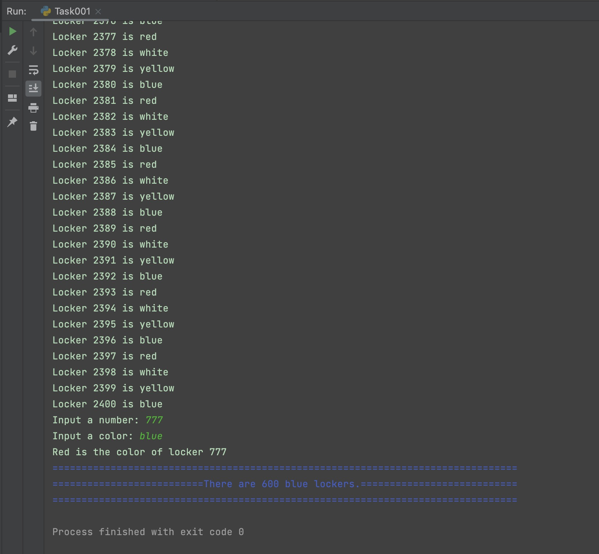

# Task 1
Task 1: Create a program and the flow diagram that shows the colors of all the lockers from 1 to 2400

Task 2: Using the program above, create another program that allows the user to enter a number and the program outputs the color that should be used in the locker.

[HL] Task 3: Create a program that receives a color from the user, validates the input,  and outputs the numbers of the lockers of the color provided. Use at least 10 different functions for Manipulating Strings (Learning Log Item 19)

[HL] Task 4: Given a list of names of students in the format lastname, firstname, create a program that assigns an email address and a locker to each student and saves the results in a file in the format lastname, firstname, email, locker 

## Code Structure
```.py
#2022-09-13 Task 1

##Importing Libaries
import random
## Universal Variables
fgc = dict(
    blue="\033[34m",
    red = "\033[31m",
    white = "\033[37m",
    yellow = "\033[33m",
)
bgc = dict(
    blue="\033[44m",
    red = "\033[41m",
    white = "\033[47m",
    yellow = "\033[43m",
)
colors = [ "blue", "red","white", "yellow"]
colorlist = []
lockernum = 2400
widthcentering = 80
## Dictionary and Initialization for Task 1.4
Names = dict()
Names["Kawada"] = "Gentaro"
Names["Lee"] = "Bernard"
Names["Honda"] = "Ryota"

LastName = ['Kawada', 'Lee', 'Honda']
with open('studentdirectory.txt', 'w') as f:
    pass

## Main Program

#Task 1.1
#Create a program and the flow diagram that shows the colors of all the lockers from 1 to 2400
for i in range(1, lockernum+1, 1):
    colorlist.append(colors[i%4])
    print("Locker", i, "is", colorlist[i-1])


#Task 1.2
#Using the program above, create another program that allows the user to enter a number and the program outputs the color that should be used in the locker.

def colorfinder(num):
    return colorlist[num-1].capitalize()

#Task 1.3: [HL] Create a program that receives a color from the user, validates the input,  and outputs the numbers of the lockers of the color provided. Use at least 10 different functions for Manipulating Strings
#Main Program

def numberfinder(color):
    if color.isalpha():
        if color in colors:
            temp = f"There are {colorlist.count(color)} {choice_color} lockers."
            while temp.isprintable():
                temp = temp.upper()
                temp = temp.lower()
                temp = temp.capitalize()
                temp = temp.center(widthcentering, "=")
                temp = (fgc[choice_color] + temp)
            return temp

#Main Program
choice_num = input("Input a number: ")
choice_color = input("Input a color: ")

while not choice_num.isnumeric():
    choice_num = input("Input a number: ")
while not choice_color.isalpha():
    choice_color = input("Input a color: ")
choice_num = int(choice_num)

print(f"{colorfinder(choice_num)} is the color of locker {choice_num}")
print(fgc[choice_color] + "=" * widthcentering)
print(fgc[choice_color] + numberfinder(choice_color))
print(fgc[choice_color] + "=" * widthcentering)

## Task 1.4 : [HL] Given a list of names of students in the format lastname, firstname, create a program that assigns an email address and a locker to each student and saves the results in a file in the format lastname, firstname, email, locker
for ln in LastName:
    templockernum = random.randint(1,2400)
    final = (f"{ln}, {Names[ln]}, {Names[ln]}.{ln}@uwcisak.jp, locker {templockernum}"),
    with open('studentdirectory.txt', 'a') as f:
        f.write(str(final))
        f.write("\n")
        f.close()
```

## Solutions
### Screenshot

*Fig.1* **Screenshot showing the results of the program**
### Formatted Text File
```.txt
('Kawada, Gentaro, Gentaro.Kawada@uwcisak.jp, locker 726',)
('Lee, Bernard, Bernard.Lee@uwcisak.jp, locker 294',)
('Honda, Ryota, Ryota.Honda@uwcisak.jp, locker 1106',)
```

