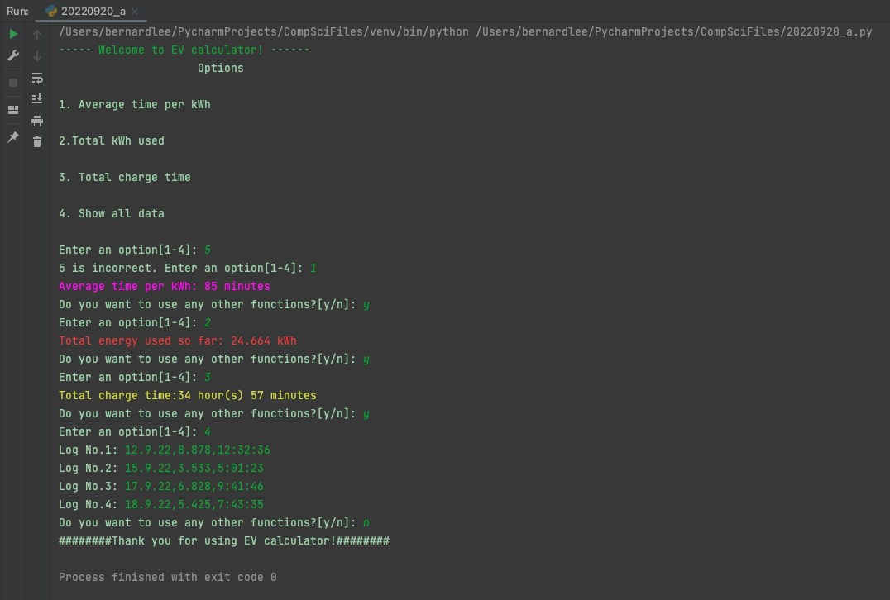

# EV Calculator

This is a example program for writing and reading files in Python

## Code Structure
```.py
# Example program for writing and reading files in Python
from my_library import validate_int_input

colors = ["\033[0;30m", "\033[0;31m", "\033[0;32m", "\033[0;33m", "\033[0;34m", "\033[0;35m", "\033[0;36m",
          "\033[0;37m", "\033[0;38m", "\033[0;39m", "\033[0;40m", "\033[0;41m", "\033[0;42m", "\033[0;43m",
          "\033[0;44m", "\033[0;45m", "\033[0;46m", "\033[0;47m", "\033[0;48m", "\033[0;49m", "\033[0;50m",
          "\033[0;51m", "\033[0;52m", "\033[0;53m", "\033[0;54m", "\033[0;55m", "\033[0;56m", "\033[0;57m",
          "\033[0;58m", "\033[0;59m", "\033[0;60m", "\033[0;61m", "\033[0;62m", "\033[0;63m", "\033[0;64m",
          "\033[0;65m", "\033[0;66m", "\033[0;67m", "\033[0;68m", "\033[0;69m", "\033[0;70m", "\033[0;71m",
          "\033[0;72m", "\033[0;73m", "\033[0;74m", "\033[0;75m", "\033[0;76m", "\033[0;77m", "\033[0;78m",
          "\033[0;79m", "\033[0;80m", "\033[0;81m", "\033[0;82m", "\033[0;83m", "\033[0;84m", "\033[0;85m",
          "\033[0;86m", "\033[0;87m", "\033[0;88m", "\033[0;89m", "\033[0;90m", "\033[0;91m", "\033[0;92m"]
end_code = "\033[00m"

intro_msg = f"{colors[2]} Welcome to EV calculator! {end_code}"
print(intro_msg.center(50, "-"))

menu = """
1. Average time per kWh\n
2.Total kWh used\n
3. Total charge time\n
4. Show all data
"""
print("Options".center(50))
print(menu)
def Main():
    option = validate_int_input("Enter an option[1-4]: ")
    while not 0 < option < 5:
        option = validate_int_input(f"{option} is incorrect. Enter an option[1-4]: ")

    # this is how to read a file
    with open("20220920_charging_log.csv", "r") as f:
        ev_data = f.readlines()

    if option == 1:
        total_time = 0
        total_kwh = 0
        i=0
        for line in ev_data:
            if i > 0:
                data = line.split(",")
                #print(data)
                temp_time = data[2]
                temp_time = temp_time.split(":")
                temp_time = int(temp_time[0]) * 60 + int(temp_time[1])
                total_time += temp_time
                total_kwh += float(data[1].replace("\n", ""))
            i+=1
        print(f"{colors[5]}Average time per kWh: {int(total_time/total_kwh)} minutes{end_code}")

    if option == 2:
        i = 0
        total_charge = 0.0
        for line in ev_data:
            if i > 0:
                values = line.split(",")
                charge = values[1]
                charge_cleaned = charge[:5]
                charge_float = float(charge_cleaned)
                total_charge += charge_float
            i += 1
        print(f"{colors[1]}Total energy used so far: {total_charge} kWh{end_code}")

    if option == 3:
        total_time = 0
        i = 0
        for line in ev_data:
            if i > 0:
                data = line.split(",")
                temp_time = data[2]
                temp_time = temp_time.split(":")
                temp_time = int(temp_time[0]) * 60 + int(temp_time[1])
                total_time += temp_time
            i += 1
        print(f"{colors[3]}Total charge time:{total_time//60} hour(s) {total_time%60} minutes{end_code}")

    if option == 4:
        count = 0
        i = 0
        for line in ev_data:
            if i > 0:
                count += 1
                line=line.strip()
                print(f"Log No.{count}: {colors[2]}{line}{end_code}")
            i += 1

    state =input("Do you want to use any other functions?[y/n]: ")
    while not state.lower() in ["y", "n"]:
        state = input(f"{state} is incorrect. Do you want to use any other functions?[y/n]: ")
    else:
        if state.lower() == "y":
            Main()
        else:
            print("Thank you for using EV calculator!".center(50, "#"))
            exit()
Main()

##End of Program##
```

## CSV File Referenced
```.csv
date,charge(Kwh),duration
12.9.22,8.878,12:32:36
15.9.22,3.533,5:01:23
17.9.22,6.828,9:41:46
18.9.22,5.425,7:43:35
```

## Results

*Fig.1* **Screenshot showing the result of the program**
