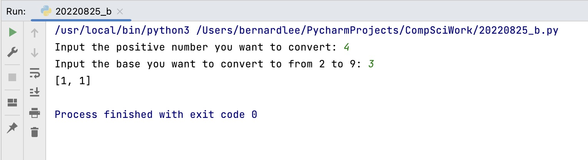
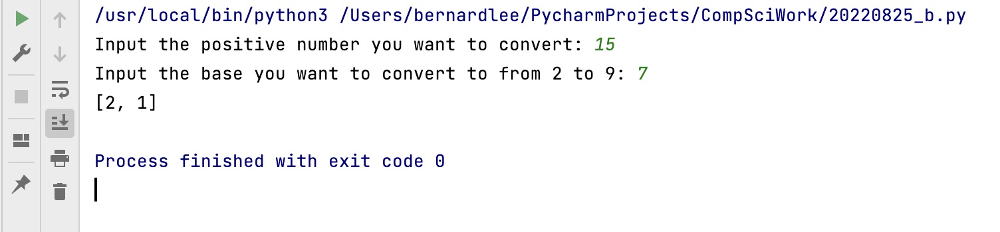
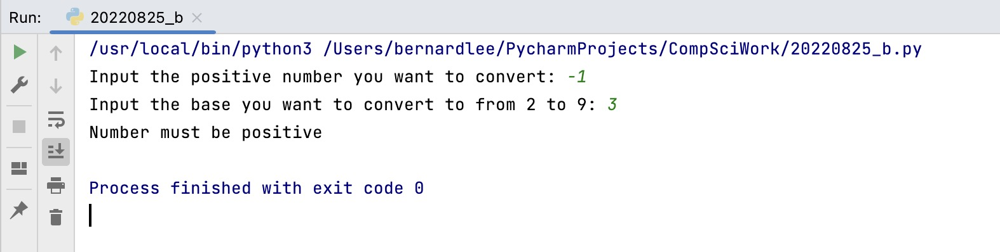

# Basic Base Converter(Array v1)
## Introduction

This is a basic base converter that converts a positive integer from Base 10 to Base 2-9 inclusive with an array written in python.

## Code Structrue
```.py
#2022-08-25 - Base Converter
#This program converts a positive integer from Base 10 to Base 2-9 inclusive with an array.

#Initizalize variables
orig_num = int(input("Input the positive number you want to convert: "))
base = int(input("Input the base you want to convert to from 2 to 9: "))
output_storage = []

#Check for invalid base
if base < 3 or base > 10:
    print("Base must be from 2 to 9 inclusive")
    exit()
    
#Check for invalid input
if orig_num < 0:
    print("Number must be positive")
    exit()

#Main calculation
div = int(orig_num/base)
mod = orig_num % base
output_storage.append(mod)

while div > base-1:
    mod = int(div%base)
    div = int(div/base)
    output_storage.append(mod)

output_storage.append(div)

#Print output
output_storage.reverse()
print(output_storage)

##End of program##

```
## Test results


*Fig.1* **Picture of results returned when original number and target base is 4 and 3 respectively**


*Fig.2* **Picture of results returned when original number and target base is 15 and 7 respectively**


*Fig.3* **Picture showing the error that would appear when user inputs a number out of range of the program**

