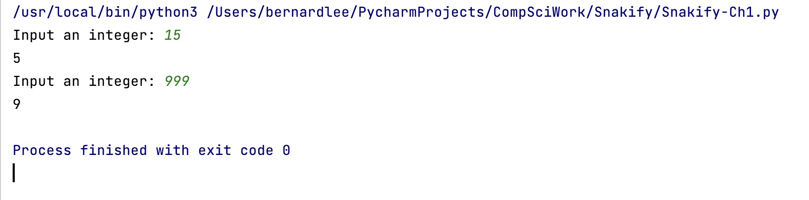

# Snakify - Chapter 1

## Print last digit

Given an integer number, print its last digit.

```.py
# Read an integer:
a = int(input("Input an integer: "))
print(a%10)

``` 

## Print tens

Given an integer. Print its tens digit.

```.py
# Read an integer:
number = int(input("Input an integer: "))

number = number//10 # integer division
answer = number%10 
print(answer)

```

## Results

Fig. 1 This is the result of the code 
